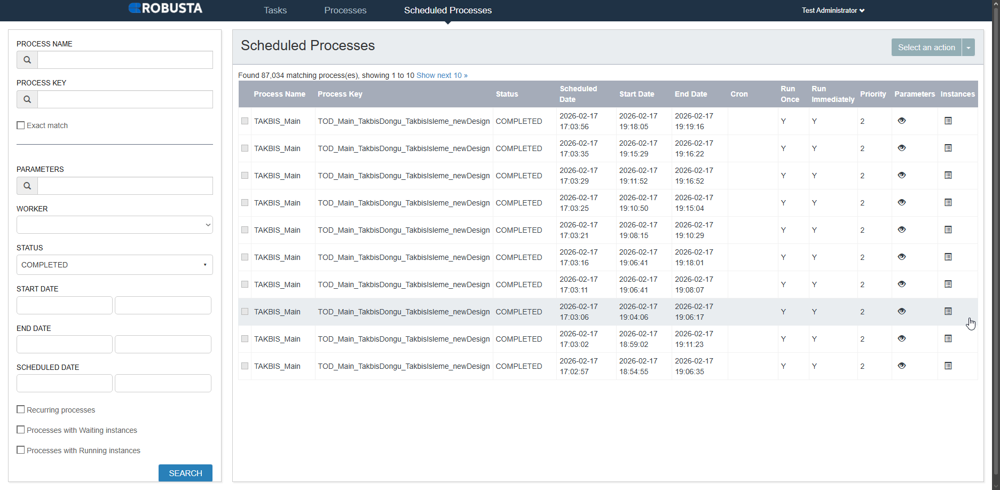

# Robusta Scheduler Helper Extension

Bu Chrome extension, Robusta Scheduler web uygulamasının kullanımını kolaylaştırır.

## Kısa Demo



## Özellikler

### v1.0.0 - Tarih Filtre Aktarımı
- **Scheduled Processes** ve **Process Instances** tablolarına hover button eklenir
- Button'a tıklandığında dropdown menü açılır:
  - **"Processes sayfasında aç"**: Start Date ve End Date bilgilerini Processes sayfasına aktarır
  - **"Screenshots sayfasında aç"**: DateRangePicker'ı görünür şekilde doldurur (kullanıcı seçimleri izler)
- Processes sayfasında tarih filtreleri otomatik doldurulur ve arama başlatılır
- Screenshots sayfasında DateRangePicker görünür şekilde açılır ve tarihler seçilir

## Kurulum

### Geliştirici Modunda Yükleme (Chrome)

1. Chrome tarayıcısını açın
2. Adres çubuğuna `chrome://extensions/` yazın
3. Sağ üstten **"Geliştirici modu"** (Developer mode) seçeneğini aktif edin
4. **"Paketlenmemiş öğe yükle"** (Load unpacked) butonuna tıklayın
5. Bu klasörü seçin

### Edge için
1. Edge tarayıcısını açın
2. Adres çubuğuna `edge://extensions/` yazın
3. Sol alt köşeden **"Geliştirici modu"** seçeneğini aktif edin
4. **"Paketlenmemiş yükle"** butonuna tıklayın
5. Bu klasörü seçin

## Kullanım

1. Robusta Scheduler'da **Scheduled Processes** sayfasına gidin
   - URL örneği: `https://host:port/scheduler/workflow/#/scheduled-processes`

2. Instance tablosundaki herhangi bir instance satırının üzerine gelin

3. Satırın sağ tarafında mavi bir filtre butonu belirecektir

4. Butona tıklayın:
   - Yeni sekmede **Processes** sayfası açılacaktır
   - **Start Date Lower Bound** ve **End Date Upper Bound** filtreleri otomatik olarak dolacaktır

## Tarih Formatlama Kuralları

- **Start Date**: Saniye kısmı kaldırılır
  - Örnek: `2026-01-28 08:02:37` → `2026-01-28 08:02`

- **End Date**: Saniye kısmı kaldırılır ve dakika 1 yukarı yuvarlanır
  - Örnek: `2026-01-28 08:15:53` → `2026-01-28 08:16`
  - Bu sayede zaman aralığı tam olarak kapsamış olur

## Teknik Detaylar

### Desteklenen URL Pattern'leri
- `*://*/scheduler/workflow/#/scheduled-processes`
- `*://*/scheduler/workflow/#/processes`

### Kullanılan İzinler
- `storage`: Tarih bilgilerini sayfalar arası aktarmak için
- `activeTab`: Aktif sekmeye erişim için

### Dosya Yapısı
```
robusta-extension/
├── manifest.json           # Extension tanımı
├── background.js           # Service worker
├── content-scripts/
│   └── main.js            # Ana içerik script'i
├── docs/
│   └── assets/
│       └── presentation.gif
├── styles/
│   └── hover-button.css   # Hover button stilleri
├── icons/
│   ├── icon-16.png/svg
│   ├── icon-48.png/svg
│   └── icon-128.png/svg
└── README.md
```

## Sorun Giderme

### Hover button görünmüyor
- Sayfayı yenileyin
- Extension'ın aktif olduğundan emin olun
- Console'da hata mesajı olup olmadığını kontrol edin (F12)

### Tarihler set edilmiyor
- Filter panelinin açılabilir durumda olduğundan emin olun
- Console'da hata mesajı kontrol edin
- Sayfayı yeniden yükleyin

### AngularJS binding çalışmıyor
- Sayfanın tamamen yüklenmesini bekleyin
- Filtre alanlarına manuel olarak bir değer girip silin, ardından tekrar deneyin

## Gelecek Geliştirmeler

- [ ] Process Key filtreleme
- [ ] Status filtreleme
- [ ] Özelleştirilebilir tarih formatı
- [ ] Sağ-tık context menu
- [ ] Keyboard shortcuts

## Lisans

Internal Use Only - Robusta Panel Helper
